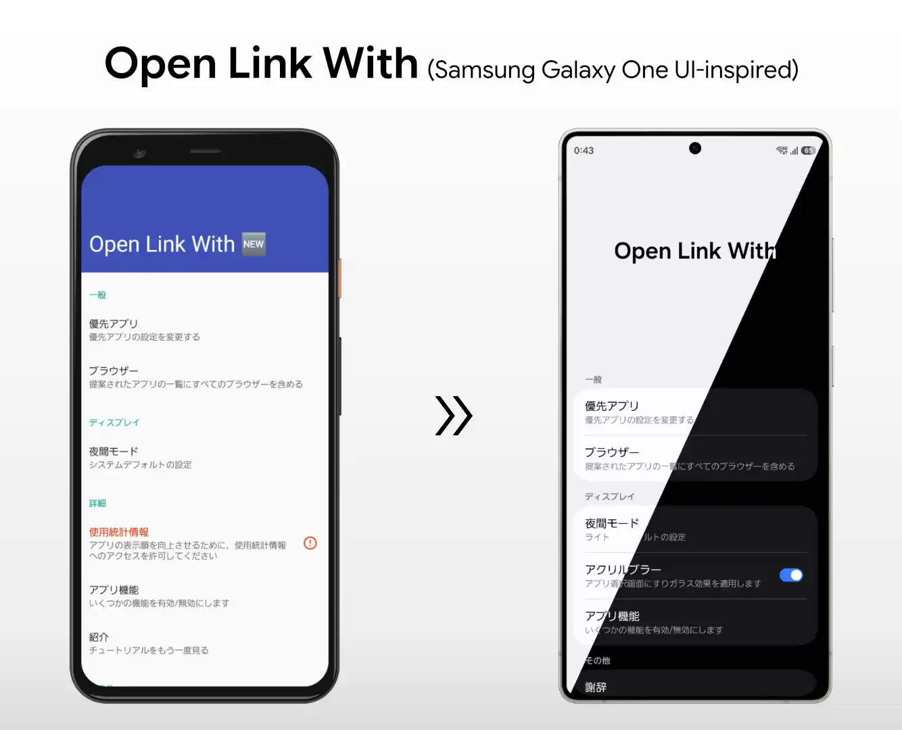
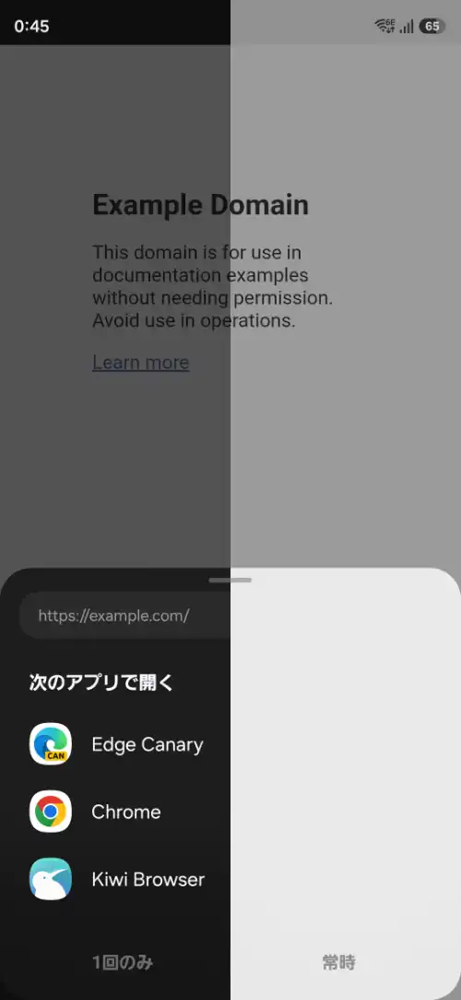
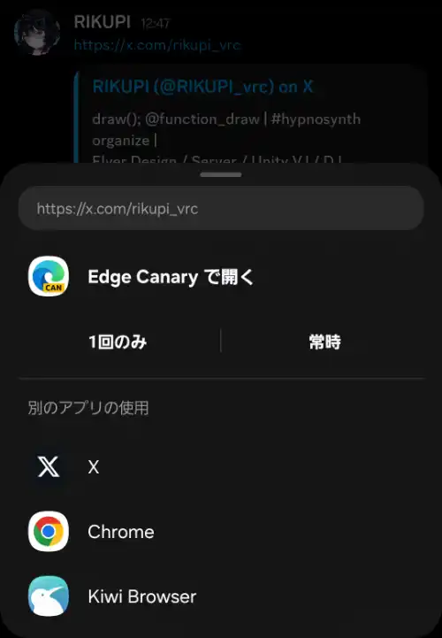

# Open Link With（日本語）

RIKUPI による個人フォークでSamsung GalaxyのOneUIに対応したバージョン、必須機能に絞りDiscordやTwitterなどのApp Linksの回避方法などを追加したバージョンです。元は Sam Leatherdale による [Open Link With: Redux](https://github.com/SamLeatherdale/OpenLinkWith) をフォークしたもので、さらにその元は Said Tahsin Dane による [Open Link With](https://github.com/tasomaniac/openlinkwith) が起源です。このプロジェクトがなければこのアプリは作ることはできませんでした。ありがとうございます。

---

## このフォークについて

このフォークは **一つのことだけ** に集中しています：リンクを開くときにダイアログを表示し、ブラウザ・ネイティブアプリ・ダウンロードマネージャーなど好きなアプリで開けるようにすること。
DiscordやXなどのApp Linksを積極的に扱うアプリからの関連付けや回避、それ以外の機能はすべて削除し、シンプルなものとして目指しました。

### 削除した機能
- ほとんどの権限
- ネットワークアクセス（OkHttp・リダイレクト追跡・URLタイトル取得）
- ホーム画面に追加
- URLクリーンアップ（トラッキングパラメーター除去）
- フォアグラウンドアプリの検出（使用状況アクセス権限）
- クリップボード連携
- 紹介・チュートリアル画面
- デバッグセクション

### 変更点

**Samsung One UI デザインの統合**

SESL（Samsung Experience Support Library）と OneUI Design Library を使用し、ToolbarLayout、OneUI スタイルの設定画面、ライト／ダークテーマに対応しています。

**アクリルブラー効果**
対応する Galaxy 端末（Android 15以降）では、アプリ選択画面にすりガラスのブラー効果を適用します。Samsung の SemBlurCompat API を使用しており、ディスプレイ設定で切り替え可能です。AQUOS Phoneなど他の端末でもチェックしていますが、アクリル表現は使えないため無効になります。

**アプリ別言語設定**
Android 13 以降のアプリ別言語設定に対応しています（英語、日本語、韓国語）。他の言語は作者が対応できないため一旦削除しております故、ご了承ください。

**予測型戻るアニメーション**
設定画面内の Fragment 遷移が Android の予測型戻るジェスチャーに対応しています。

**対応リンクの拡充**

Discord等からApp Linksを用いアプリを起動しようとする際従来では回避されていたのでこちらも対応しました。
主要なSNSドメインをサポート済みリンクとして登録しています。Android のシステム設定から各サイトのデフォルトアプリとして本アプリを指定できます。後日詳しくこのApp Linksを回避する方法の設定手順を必要であれば公開します。

| サービス | ドメイン |
|---|---|
| X / Twitter | x.com, twitter.com |
| YouTube | youtube.com, youtu.be |
| Instagram | instagram.com |
| Reddit | reddit.com, redd.it |
| TikTok | tiktok.com |
| Facebook | facebook.com |
| LinkedIn | linkedin.com |
| GitHub | github.com |

**謝辞欄**
ライセンスとは別に、改めて個人的に追加しています。ありがとうございます。

**メディアファイルリンクへの対応**
`.mp4`・`.mkv`・`.mp3`・`.m4a` などの動画・音声ファイルへのリンクを開く際もアプリ選択画面が表示されます。自動的に動画プレイヤーで開かれる代わりに、ブラウザで再生するかダウンロードマネージャーに渡すかを選べます。メディアタイプを直接選択するようなアプリ(匿名掲示板用専用ブラウザアプリ)で上手くいくかもしれません。

---

## 謝辞

- **Open Link With** — [Said Tahsin Dane](https://github.com/tasomaniac/OpenLinkWith) 、[Sam Leatherdale](https://github.com/SamLeatherdale/OpenLinkWith)  — Apache License 2.0
- **OneUI Design Library** — [Tribalfs](https://github.com/tribalfs/oneui-design)、Yanndroid、BlackMesa123 — MIT License
- **SESL**（Samsung Experience Support Library）— [Tribalfs](https://github.com/tribalfs/sesl-androidx) — Apache License 2.0

## ライセンス

このフォークへの変更は、元のライセンスと同じ条件で提供されます。

    Copyright (C) 2015 Said Tahsin Dane
    
    Licensed under the Apache License, Version 2.0 (the "License");
    you may not use this file except in compliance with the License.
    You may obtain a copy of the License at
    
       http://www.apache.org/licenses/LICENSE-2.0
    
    Unless required by applicable law or agreed to in writing, software
    distributed under the License is distributed on an "AS IS" BASIS,
    WITHOUT WARRANTIES OR CONDITIONS OF ANY KIND, either express or implied.
    See the License for the specific language governing permissions and
    limitations under the License.

---

---

# Open Link With (English)

A personal fork by RIKUPI, adapted for Samsung Galaxy's One UI design, stripped down to essential features, and with added support for bypassing App Links from apps like Discord and Twitter. This is a fork of [Open Link With: Redux](https://github.com/SamLeatherdale/OpenLinkWith) by Sam Leatherdale, which itself is a fork of the [original Open Link With](https://github.com/tasomaniac/openlinkwith) by Said Tahsin Dane. This app would not have been possible without their work. Thank you.

---

## About this fork

This fork focuses on **one thing**: showing a chooser dialog when you open a link, so you can pick which app handles it — browsers, native apps, or download managers.
It also addresses App Links being aggressively claimed by apps like Discord and X. Everything else has been removed to keep it simple.

### Removed features
- Most permissions
- Network access (OkHttp, redirect following, URL title fetching)
- Add to Home Screen
- URL cleanup (tracking parameter removal)
- Foreground app detection (usage stats permission)
- Clipboard integration
- Introduction / tutorial screen
- Debug section

### Changes

**Samsung One UI design integration**

Uses SESL (Samsung Experience Support Library) and the OneUI Design Library for ToolbarLayout, OneUI-styled preference screens, and proper light/dark theme support.

**Acrylic blur effect**
On supported Galaxy devices (Android 15+), the app chooser uses a frosted glass blur effect via Samsung's SemBlurCompat API. This can be toggled in Display settings. On non-Galaxy devices such as AQUOS Phone, the acrylic effect is not available and will be disabled.

**Per-app language support**
Supports Android 13+ per-app language preferences (English, Japanese, Korean). Other languages have been removed for now as the author cannot maintain them.

**Predictive back animation**
Fragment transitions within Settings support Android's predictive back gesture.

**Expanded link handling**

Apps like Discord use App Links to force-open links in their own browser, bypassing user choice. This fork addresses that.
Popular social media domains are registered as supported links, so you can set this app as the default handler for specific sites through Android system settings. A detailed setup guide for bypassing App Links may be published later if needed.

| Service | Domains |
|---|---|
| X / Twitter | x.com, twitter.com |
| YouTube | youtube.com, youtu.be |
| Instagram | instagram.com |
| Reddit | reddit.com, redd.it |
| TikTok | tiktok.com |
| Facebook | facebook.com |
| LinkedIn | linkedin.com |
| GitHub | github.com |

**Acknowledgements section**
Added separately from the license as a personal thank-you to the projects this app is built upon.

**Media file link handling**
Links to video and audio files (`.mp4`, `.mkv`, `.mp3`, `.m4a`, etc.) now show the app chooser as well. Instead of automatically opening in a video player, you can choose to stream in a browser or pass to a download manager. This may work well with apps that directly select media types (e.g. dedicated anonymous imageboard browser apps).

---

## Acknowledgements

- **Open Link With** — [Said Tahsin Dane](https://github.com/tasomaniac/OpenLinkWith) 、[Sam Leatherdale](https://github.com/SamLeatherdale/OpenLinkWith)  — Apache License 2.0
- **OneUI Design Library** — [Tribalfs](https://github.com/tribalfs/oneui-design)、Yanndroid、BlackMesa123 — MIT License
- **SESL**（Samsung Experience Support Library）— [Tribalfs](https://github.com/tribalfs/sesl-androidx) — Apache License 2.0

## License

Modifications in this fork are made under the same license as the original.

    Copyright (C) 2015 Said Tahsin Dane
    
    Licensed under the Apache License, Version 2.0 (the "License");
    you may not use this file except in compliance with the License.
    You may obtain a copy of the License at
    
       http://www.apache.org/licenses/LICENSE-2.0
    
    Unless required by applicable law or agreed to in writing, software
    distributed under the License is distributed on an "AS IS" BASIS,
    WITHOUT WARRANTIES OR CONDITIONS OF ANY KIND, either express or implied.
    See the License for the specific language governing permissions and
    limitations under the License.