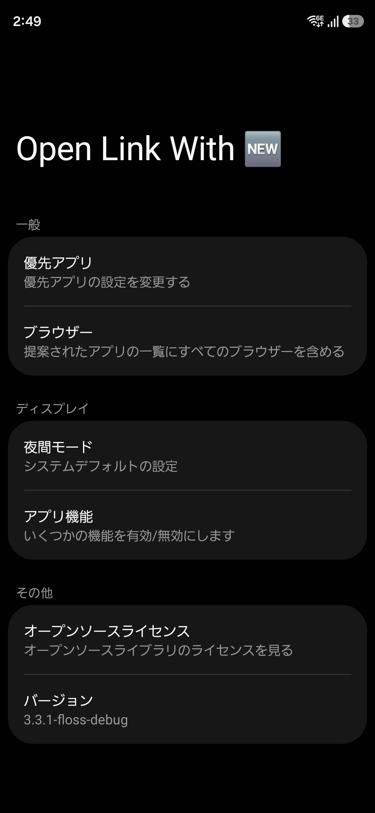
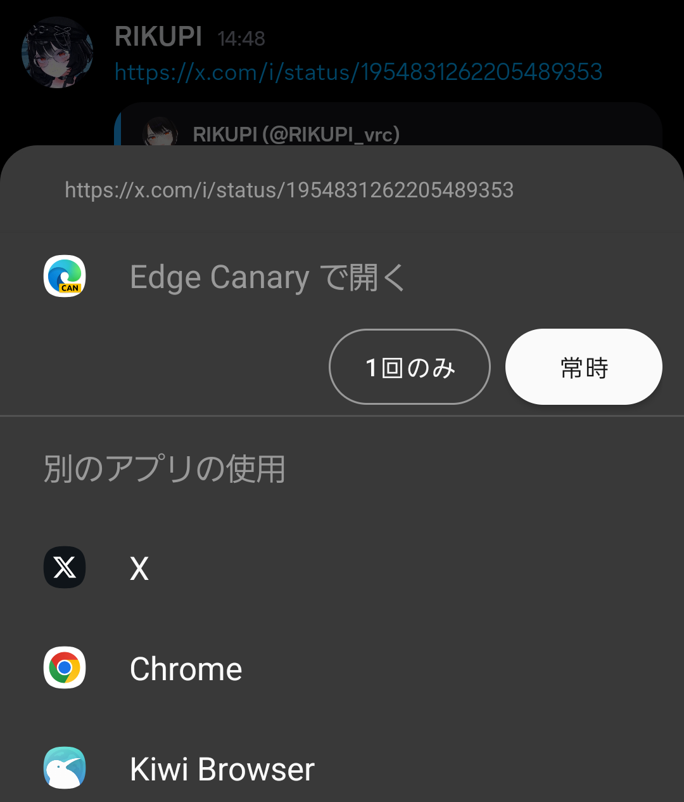
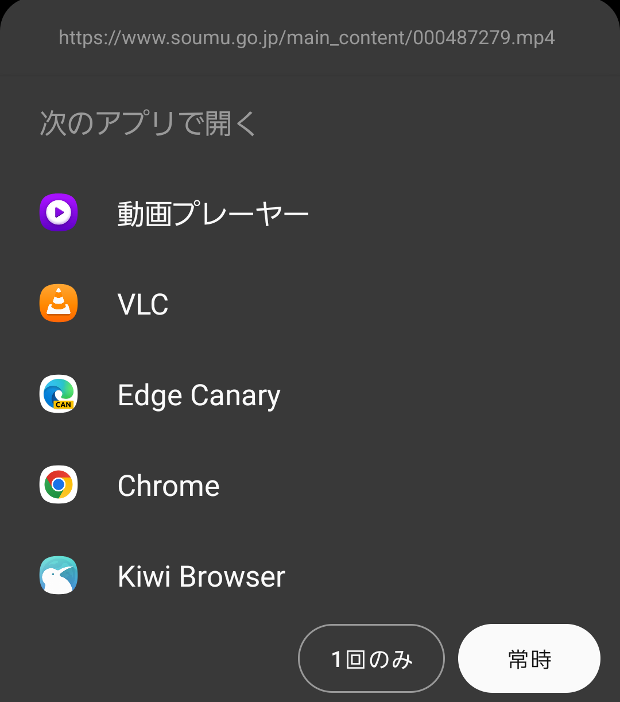

# Open Link With



A personal fork of [Open Link With: Redux](https://github.com/SamLeatherdale/OpenLinkWith) by Sam Leatherdale, which itself is a fork of the [original Open Link With](https://github.com/tasomaniac/openlinkwith) by Said Tahsin Dane.

---

## What is this fork?

This fork focuses exclusively on **one thing**: showing a chooser dialog when you open a link, so you can decide which app handles it — including browsers, native apps, or download managers.

Everything else has been stripped away to keep the app lightweight and purposeful.

### What was removed

- Network access (OkHttp, redirect following, URL title fetching)
- Add to Home Screen
- URL cleanup / tracking parameter removal
- Foreground app detection (usage stats permission)
- Clipboard integration
- Introduction / tutorial screen
- Rating prompt
- Debug section

### What was added or improved

**Samsung OneUI-inspired design**
The UI has been restyled to follow Samsung OneUI conventions: grouped preference cards on a gray background, pill-shaped buttons, and proper light/dark theme support.

**Expanded link handling**



Popular social media domains are registered as supported links, so you can set this app as the default handler for specific sites through Android system settings:

| Service | Domains |
|---|---|
| X / Twitter | x.com, twitter.com |
| YouTube | youtube.com, youtu.be |
| Instagram | instagram.com |
| Reddit | reddit.com, redd.it |
| TikTok | tiktok.com |
| Facebook | facebook.com |
| LinkedIn | linkedin.com |
| GitHub | github.com |

**Media file link handling**



Links to video and audio files (`.mp4`, `.mkv`, `.mp3`, `.m4a`, etc.) are now intercepted, so you can choose to open them in a browser, stream in a player, or pass to a download manager instead of having them open automatically.

---

## How to build

```
./gradlew assembleFlossDebug
```

---

## License

Modifications in this fork are made under the same license as the original.

    Copyright (C) 2015 Said Tahsin Dane

    Licensed under the Apache License, Version 2.0 (the "License");
    you may not use this file except in compliance with the License.
    You may obtain a copy of the License at

       http://www.apache.org/licenses/LICENSE-2.0

    Unless required by applicable law or agreed to in writing, software
    distributed under the License is distributed on an "AS IS" BASIS,
    WITHOUT WARRANTIES OR CONDITIONS OF ANY KIND, either express or implied.
    See the License for the specific language governing permissions and
    limitations under the License.

---

---

# Open Link With（日本語）

[Open Link With: Redux](https://github.com/SamLeatherdale/OpenLinkWith)（Sam Leatherdale）の個人フォークです。元は Said Tahsin Dane による [Open Link With](https://github.com/tasomaniac/openlinkwith) が起源です。

---

## このフォークについて

このフォークは **一つのことだけ** に集中しています：リンクを開くときにチューザーダイアログを表示し、ブラウザ・ネイティブアプリ・ダウンロードマネージャーなど好きなアプリで開けるようにすること。

それ以外の機能はすべて削除し、軽量でシンプルなアプリを目指しています。

### 削除した機能

- ネットワークアクセス（OkHttp・リダイレクト追跡・URLタイトル取得）
- ホーム画面に追加
- URLクリーンアップ（トラッキングパラメーター除去）
- フォアグラウンドアプリの検出（使用状況アクセス権限）
- クリップボード連携
- 紹介・チュートリアル画面
- レーティング催促
- デバッグセクション

### 追加・改善した点

**Samsung OneUI デザインに着想を得た UI**
設定画面のスタイルを Samsung OneUI の設計に合わせて刷新しました。グレー背景上のグループカード形式のプレファレンスリスト、ピル型ボタン、ライト／ダークテーマの適切な対応が含まれます。

**対応リンクの拡充**
主要なSNSドメインをサポート済みリンクとして登録しています。Android のシステム設定から各サイトのデフォルトアプリとして本アプリを指定できます

| サービス | ドメイン |
|---|---|
| X / Twitter | x.com, twitter.com |
| YouTube | youtube.com, youtu.be |
| Instagram | instagram.com |
| Reddit | reddit.com, redd.it |
| TikTok | tiktok.com |
| Facebook | facebook.com |
| LinkedIn | linkedin.com |
| GitHub | github.com |

**メディアファイルリンクへの対応**
`.mp4`・`.mkv`・`.mp3`・`.m4a` などの動画・音声ファイルへのリンクを開く際もチューザーが表示されます。自動的に動画プレイヤーで開かれる代わりに、ブラウザで再生するかダウンロードマネージャーに渡すかを選べます。

---

## ビルド方法

```
./gradlew assembleFlossDebug
```

---

## ライセンス

このフォークへの変更は、元のライセンスと同じ条件で提供されます。

    Copyright (C) 2015 Said Tahsin Dane

    Apache License, Version 2.0 に基づきライセンスされています。
    詳細は上記の英語ライセンス条文を参照してください。
